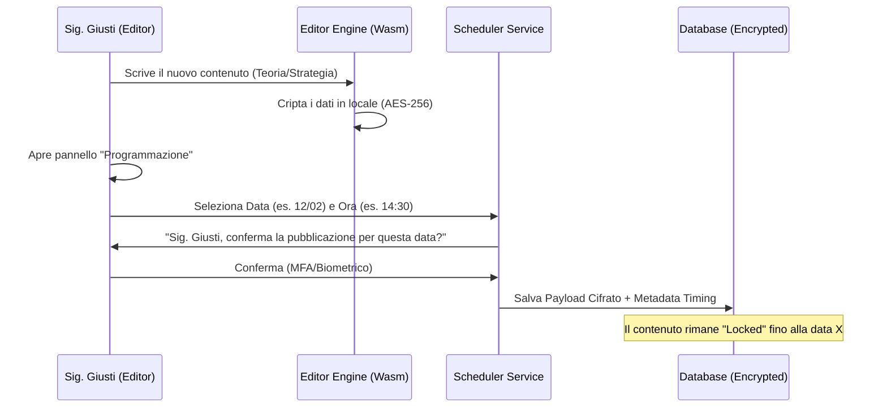
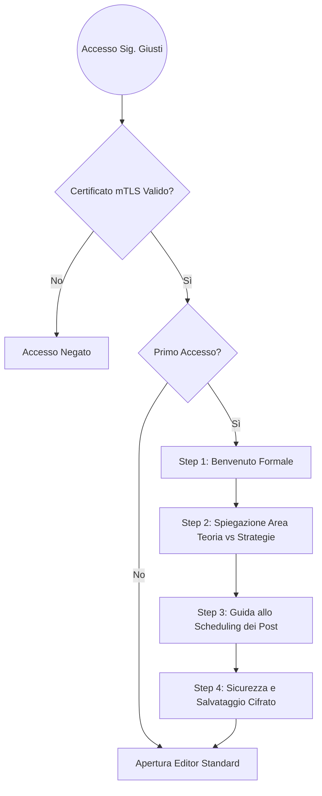
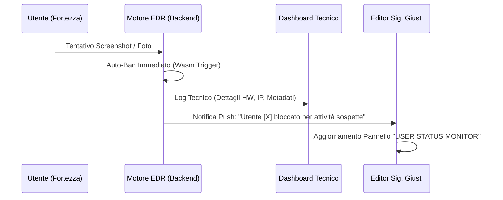
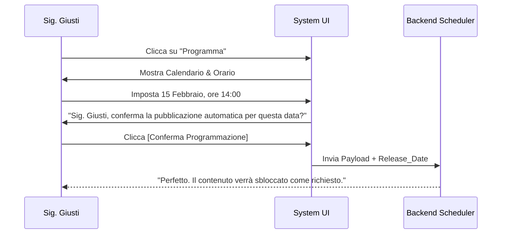

**Proprietà:** Progetto GG PLATFORM

**Riservatezza:** Accesso esclusivo tramite certificato mTLS

**Utente Finale:** Sig. Giuliano Giusti

---

## 1. Architettura dell'Interfaccia (Visual Hierarchy)

L'interfaccia deve eliminare ogni "rumore" visivo. Utilizzeremo un layout a tre colonne dinamiche.

- **Colonna Sinistra (Navigator):** Gestione della libreria contenuti. Divisione netta tra cartelle "Teoria" e "Strategie".
    
- **Colonna Centrale (The Canvas):** L'area di scrittura pura. Un editor WYSIWYG (What You See Is What You Get) dove il Markdown viene renderizzato istantaneamente.
    
- **Colonna Destra (Inspector & Schedule):** Pannello contestuale per i metadati, i widget di trading e il nuovo modulo di programmazione temporale.
    
#### 1.1 Security Live Feed (Intelligence in tempo reale)

Per garantire che Lei, Sig. Giusti, sia sempre al corrente della sicurezza della Sua piattaforma senza dover consultare il tecnico, l'Inspector include un modulo di notifica intelligente:

- **Badge di Stato:** Un indicatore cromatico dinamico:
    - ⚪ **Grigio:** Un utente ha rifiutato le policy al Gatekeeper.
    - 🟡 **Giallo:** Rilevata attività sospetta (es. tentativo di screenshot).
    - 🔴 **Rosso:** Tentativo di hacking neutralizzato.
- **Interazione:** Al click su un alert, si apre istantaneamente il pop-up **"Dettagli Tecnici Forensi"** con le prove raccolte dal SOC.

---

## 2. Flusso di Creazione e Programmazione (Scheduling)

Questa è la nuova feature fondamentale. Il Sig. Giusti deve poter gestire il suo tempo in modo efficiente. Il sistema gli darà del "Lei" durante ogni conferma.

### Diagramma di Flusso: Creazione e Programmazione

---

## 3. Integrazione Widget "Strategie"

Per la sezione Strategie, l'editor non è solo testuale. Il Sig. Giusti potrà trascinare dei moduli interattivi direttamente nel testo.

- **Modulo Grafico:** Integrazione API TradingView con annotazioni salvate nel database proprietario.
    
- **Modulo Risk/Reward:** Un calcolatore dinamico dove il Sig. Giusti imposta i parametri e l'utente finale può solo visualizzare o simulare i propri.
    
- **Modulo Segnale:** Un tasto "Call to Action" immediato per avvisare gli utenti di una nuova opportunità.
    

---

## 4. Onboarding: Il Tutorial Interattivo

Al primo accesso del Sig. Giusti, l'editor verrà oscurato da un overlay elegante.

### Flusso del Tutorial (Logic Path)

---

## 5. Specifiche di Sicurezza dell'Editor

Mentre il Sig. Giusti scrive, il sistema opera in background:

1. **Auto-Save Locale:** Salvataggio crittografato nel `localStorage` del browser (gestito da Wasm) per prevenire perdite di dati in caso di crash.
    
2. **Heartbeat SOC:** Ogni 30 secondi, l'editor invia un segnale al SOC per confermare che l'accesso è ancora effettuato dal dispositivo autorizzato.
    
3. **Sanificazione:** Ogni input viene pulito da script malevoli prima di essere inviato al server di Render.

### 6.  Sistema di Notifiche "Intelligence" per il Sig. Giusti

Le notifiche arriveranno nella **Professional Suite** del Sig. Giusti. Ogni notifica avrà un colore e un'icona specifica per permettergli di capire la gravità in un millisecondo.

|**Evento**|**Testo Notifica**|**Colore/Icona**|
|---|---|---|
|**Rifiuto Policy**|"Utente [X] si è rifiutato di accettare le policy."|⚪ Grigio (Informativa)|
|**Attività Sospetta**|"Utente [X] è stato bloccato per attività sospette (Tentata Condivisione)."|🟡 Giallo (Warning)|
|**Tentato Hacking**|"L'utente [X] è stato bloccato per tentato hacking."|🔴 Rosso (Critical)|

---

### 7. Nuovo Pannello: "USER STATUS MONITOR"

All'interno della dashboard del Sig. Giusti, aggiungeremo una sezione dedicata al monitoraggio. Questo non è il pannello tecnico del SOC, ma una **versione semplificata e autorevole** per il cliente.

#### Visual Hierarchy del Pannello:

- **Widget Superiore (Summary):** * Totale Utenti Attivi (Verde)
    
    - Totale Utenti Bloccati/Respinti (Rosso)
        
- **Tabella degli Stati:**
    
    - **NICKNAME:** Identità utente.
        
    - **STATO:** [Attivo] / [Bloccato] / [Policy Respinta].
        
    - **MOTIVAZIONE:** (es: "Tentativo Screenshot", "Rifiuto al Gate", "Iniezione Script").
        
    - **DATA/ORA:** Ultima interazione.
        

---

### 8. Diagramma di Flusso: Gestione Alert e Notifiche

Questo diagramma rappresenta come il sistema smista le informazioni tra il SOC e il Sig. Giusti.

Snippet di codice

---

### 9. Componente: Selettore Tipologia (Teoria vs Strategia)

Per soddisfare la richiesta di divisione netta tra i contenuti, l'Editor non sarà un semplice foglio bianco, ma richiederà una scelta semantica iniziale.

- **Interfaccia:** Un interruttore (Toggle) elegante in alto a destra.
    
- **Comportamento:**
    
    - **Modalità Teoria:** L'interfaccia attiva strumenti di formattazione avanzata (Capitoli, Citazioni, Note a margine). Il sistema le dirà: _"Sig. Giusti, sta redigendo un contenuto formativo. Il layout è ottimizzato per la lettura."_
        
    - **Modalità Strategie:** Si attiva la libreria di **Widget Dinamici**. Compaiono i tasti per inserire grafici TradingView, Calcolatori Risk/Reward e il tasto "Segnale Live". Il sistema le dirà: _"Sig. Giusti, sta creando una strategia operativa. I moduli interattivi sono pronti."_
        

---

### 10. Componente: User Status Monitor (Professional View)

Questa è la sezione dove il Sig. Giusti monitora chi entra nella sua fortezza. Deve essere semplice, senza i tecnicismi eccessivi del SOC.

#### 10.1 Rendering Protetto (Sandbox Preview)
L'integrità del Suo ambiente di lavoro è la nostra priorità. Ogni widget (TradingView, Calcolatori) inserito nel Canvas segue il protocollo di isolamento:

- **Isolamento Totale:** I widget vengono renderizzati in iframe "Sandboxed". Questo impedisce a script esterni di "leggere" il testo delle Sue strategie mentre le sta scrivendo.
- **Wasm Bridge:** L'anteprima dei dati dinamici avviene tramite un ponte unidirezionale cifrato. Il widget riceve solo i dati necessari alla visualizzazione, senza alcun accesso alla memoria dell'Editor.

| **Utente** | **Stato**         | **Ultima Azione**  | **Dettagli**                |
| ---------- | ----------------- | ------------------ | --------------------------- |
| Trader_01  | ✅ Attivo          | Lettura Capitolo 2 | [Lente Ingrandimento]       |
| User_Alpha | ⚪ Policy Respinta | Rifiuto al Gate    | [Lente Ingrandimento]       |
| Hack_Me    | 🔴 Bloccato       | Tentato Screenshot | **[Vedi Dettagli Tecnici]** |

---

### 11. Componente: Modal "Dettagli Tecnici" (Forensic View)

Quando il Sig. Giusti clicca sul tasto rosso **[Vedi Dettagli Tecnici]**, si apre un popup protetto che mostra le prove fornite dal SOC.

- **Header:** Nome Utente + Timestamp del Ban.
    
- **Dati Visualizzati:**
    
    - **Motivo del Blocco:** Descrizione colloquiale (es: "L'utente ha cercato di fotografare lo schermo o fare uno screenshot").
        
    - **Analisi del Dispositivo:** Hardware ID e Sistema Operativo.
        
    - **Geolocalizzazione:** Città e Provider Internet.
        
    - **Confidence:** "Sicurezza del blocco: 100%".
        

#### 11.2 Azione di Ripristino (Pardon System)

Accanto ad ogni utente con stato "Bloccato" o "Policy Respinta", è presente una funzione dedicata:

- **Tasto "Ripristina Accesso":** Se Lei ritiene che un blocco sia stato un errore o desidera dare una seconda possibilità a un utente, questo tasto invia un comando immediato al SOC.
- **Effetto:** L'Hardware ID dell'utente viene rimosso dalla Blacklist e il suo "Trust Score" viene resettato, permettendogli di accedere nuovamente al Gatekeeper.

---

### 12. Componente: Pannello Scheduling (Programmazione)

#### 12.1 Integrità della Programmazione

- **Zero-Knowledge Release:** Quando Lei programma un contenuto, il sistema salva i dati già cifrati in locale dal Suo modulo Wasm. 
- **Sblocco Temporale:** Il server non possiede la chiave per leggere il contenuto; si limita a "consegnare" il file cifrato agli utenti solo nel momento esatto da Lei stabilito nel calendario.

Il modulo per la pubblicazione posticipata deve essere a prova di errore.

- **Interazione:** Accanto al tasto "Pubblica Ora", è presente l'icona "Orologio".
    
- **Il Calendario:** Un date-picker minimale (Apple-style) dove selezionare giorno e ora esatta (minuti inclusi).
    
- **Flusso di Conferma:**
    

---

### 13. Messaggistica di Sistema (Tone of Voice)

In ogni fase di errore o successo, l'Editor si rivolgerà al professionista così:

- **Errore caricamento:** _"Ci scusi, Sig. Giusti. Non è stato possibile salvare la bozza. Verifichi la Sua connessione."_
    
- **Pubblicazione avvenuta:** _"Complimenti, Sig. Giusti. Il Suo nuovo contenuto è ora disponibile per gli utenti autorizzati."_