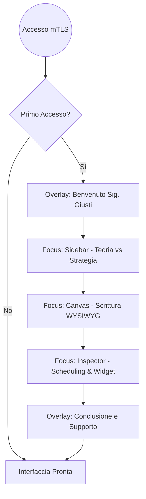

**Proprietà:** Progetto GG PLATFORM

**Tono di Voce:** Formale, Rispettoso ("Lei"), Autorevole, Conciso.

**Obiettivo:** Rendere il Sig. Giusti operativo in meno di 120 secondi.

---

## 1. Il Flusso Logico di Benvenuto

Il tutorial si attiva **solo al primo login** rilevato dal sistema mTLS. Utilizzeremo un effetto "Spotlight" (l'interfaccia si oscura e viene illuminata solo la zona d'interesse).




---

## 2. Script e Interazioni (Copywriting & UI)

### Step 1: Il Benvenuto

- **Visual:** Sfondo oscurato al 70%. Al centro un box elegante con il logo della piattaforma.
    
- **Testo:** > "Benvenuto, Sig. Giusti. Abbiamo preparato la Sua postazione di comando digitale. Questa piattaforma è stata progettata per proteggere il Suo sapere e massimizzare la Sua efficacia operativa. Le mostriamo brevemente i Suoi nuovi strumenti."
    
- **CTA:** [Iniziamo]
    

### Step 2: La Gerarchia (Sidebar)

- **Visual:** Spotlight sulla colonna sinistra.
    
- **Testo:** > "Qui può organizzare il Suo archivio. La sezione **Teoria** è dedicata alla formazione dei Suoi utenti, mentre in **Strategie** troverà i moduli interattivi per l'operatività in tempo reale."
    

### Step 3: La Programmazione (Scheduling)

- **Visual:** Spotlight sul pulsante "Programma" nel pannello di destra.
    
- **Testo:** > "Il Suo tempo è prezioso. Grazie a questa funzione, Lei può redigere i contenuti in anticipo e decidere il momento esatto in cui verranno sbloccati per i Suoi utenti. Il sistema si occuperà di tutto il resto in totale autonomia."
    

### Step 4: La Sua Chiave Personale

- **Visual:** Un'animazione che mostra un lucchetto d'oro che si chiude.
    
- **Testo:** > "Sig. Giusti, grazie al certificato digitale (mTLS) installato su questo dispositivo, Lei è l'unico possessore della 'Chiave Master'. Nessuno, nemmeno i nostri tecnici o potenziali intrusi, può accedere a questo Editor o modificare i Suoi contenuti senza la Sua autorizzazione hardware."

---

## 3. Gestione della Semplicità (UX Rules)

Per mantenere la promessa di "Super Semplicità", il tutorial seguirà queste regole tecniche:

1. **Niente X di chiusura:** Il Sig. Giusti non deve aver paura di "chiudere per errore". Ci sono solo tasti "Avanti".
    
2. **Ripristino:** Un tasto "Guida" rimarrà sempre visibile nell'angolo in basso a destra nel caso volesse rivedere il tutorial in futuro.
    
3. **Linguaggio Dinamico:** Il sistema userà variabili per salutarlo (es: _"Buon pomeriggio, Sig. Giusti"_ basato sull'orario del sistema).
    

---

## 4. Schema Tecnico del Tutorial

Snippet di codice

```
sequenceDiagram
    participant B as Browser (Sig. Giusti)
    participant W as Wasm Module
    participant API as Backend API

    B->>API: Login mTLS Success
    API->>B: Return UserProfile { first_login: true }
    B->>W: Initialize OnboardingOverlay
    W->>B: Render Step 1 (Welcome)
    B->>B: User clicks 'Next'
    W->>B: Highlight Sidebar (Step 2)
    B->>B: User clicks 'Finish'
    B->>API: POST /v1/admin/onboarding_complete
    Note right of API: Aggiorna il database: first_login = false
```