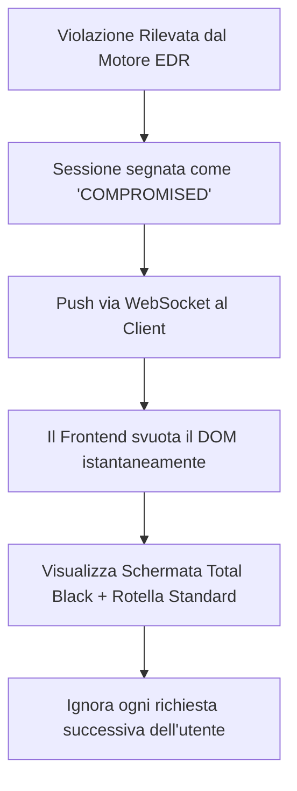

**"The Black Hole Strategy"**.

L'obiettivo è la **frustrazione psicologica**. Se l'utente riceve un errore esplicito, sa di essere stato scoperto e proverà a cambiare strategia (es. cambiare VPN, browser o tecnica). Se vede la stessa rotellina di caricamento che ha visto all'inizio, penserà che il sistema sia andato in crash o che la sua connessione sia lenta. Questo lo porterà a perdere tempo prezioso aspettando il nulla.

Ecco come implementiamo questa logica a livello di codice e infrastruttura:

---

## 1. Algoritmo di "Shadow Ban" e Reindirizzamento

Quando il sistema (Backend o SOC) identifica un attacco, non interrompe bruscamente la connessione (che darebbe un errore di rete), ma modifica lo stato della sessione in tempo reale.

Snippet di codice



### Dettagli Tecnici del Blocco:

- **Svuotamento della Memoria:** Prima di mostrare la rotella, il client cancella ogni variabile locale che contiene parti della strategia. Se l'utente prova a ispezionare la memoria del browser, non troverà nulla.
    
- **Persistent Blackhole:** Salviamo l'hash del dispositivo (`fingerprint_hash`) in una tabella di "Blacklist Silenziosa" su Supabase. Ogni volta che quell'utente proverà a rientrare, vedrà sempre e solo la rotella, senza mai ricevere un messaggio di errore.


Qui dobbiamo enfatizzare che il **Ghost Traffic** è riservato alle minacce attive (Giallo/Rosso) per massimizzare la loro frustrazione.

- **Raffinamento Logica:** > "Il protocollo **Ghost Traffic** si innesca esclusivamente per violazioni di sicurezza rilevate dal motore EDR (Screenshot, Debugger, Hacking). Mentre per il rifiuto delle policy l'utente viene semplicemente ignorato, qui l'utente viene 'ingannato': il server continua a inviare pacchetti di **Junk Data** (dati spazzatura) con lunghezze variabili. Questo costringe il dispositivo dell'attaccante a lavorare per tentare di decifrare il nulla, saturando i suoi processi di analisi mentre la rotellina gira all'infinito."


---

## 2. Il SOC durante l'Attacco

Mentre l'utente fissa la rotella, il tecnico vede esattamente cosa sta succedendo.

- **Stato Utente:** Nel pannello SOC, l'icona dell'utente diventa **Viola** (Shadow Banned).
    
- **Alert Details:** Il tecnico legge: _"Utente TraderX bloccato. Motivo: Tentativo di iniezione SQL rilevato. L'utente è attualmente nel Blackhole (visualizza rotella di caricamento)."_
    
- **Unban Manuale:** Se il tecnico si accorge che è stato un falso positivo (raro con il nostro sistema), può sbloccare l'utente e il notebook riapparirà magicamente sulla sua schermata.
    

---

## 3. Coerenza del Design

La schermata di "blocco" deve essere identica a quella di "attesa approvazione".

- **CSS:** * Background: `#000000`
    
    - Spinner: Una rotella minimale, grigio scura, con animazione fluida a 60fps.
        
    - Nessun testo (il silenzio è più snervante).
        

---

## 4. Perché questa è la soluzione definitiva?

In un attacco di **Red Teaming**, l'attaccante cerca feedback.

- Se gli dai un errore, lo hai istruito.
    
- Se gli dai il nulla, lo hai neutralizzato.
    

Dal punto di vista dell'occupazione delle risorse su Render e Supabase, l'utente bloccato non consuma quasi nulla, poiché il server risponderà con pacchetti vuoti o ignorerà del tutto le sue chiamate API.

## AGGIUNTA DETTAGLI 

Affidarsi esclusivamente a un database relazionale per operazioni di sicurezza in tempo reale è un errore da principianti che non possiamo permetterci. L'introduzione di un livello di caching distribuito e del traffico specchietto alza l'asticella a un livello dove anche un Red Team esperto rimarrebbe disorientato.


---

### 1. Diagramma di Stato della Sessione (State Machine)

Per evitare _race conditions_, lo stato dell'utente deve essere atomico. Questo diagramma definisce come il sistema gestisce la transizione tra la legittimità e il "buco nero".

Snippet di codice

```
stateDiagram-v2
    [*] --> ACTIVE: Fingerprint Validato
    
    ACTIVE --> SUSPICIOUS: Trigger Alert (es. F12, Tab Switch)
    SUSPICIOUS --> ACTIVE: Comportamento rientrato (Tempo > 5min)
    
    SUSPICIOUS --> SHADOW_BANNED: Violazione Critica (Screenshot/DRM)
    ACTIVE --> SHADOW_BANNED: Violazione Diretta (SQLi/XSS)
    
    state SHADOW_BANNED {
        [*] --> GhostTraffic: Init Redis Flag
        GhostTraffic --> InfiniteLoading: Render Rotellina
    }
    
    SHADOW_BANNED --> HARD_BANNED: Conferma Manuale Tecnico SOC
    HARD_BANNED --> [*]: Blacklist Hardware Permanente
```

---

### 2. Architettura Tecnica: Redis come "Fast-Kill Switch"

In una multinazionale, non interrogheremmo mai PostgreSQL (Supabase) per ogni singolo pacchetto. Useremo **Redis** (disponibile gratuitamente su Upstash o simili) come strato di memoria ultra-veloce.

- **Latenza < 1ms:** Quando l'utente muove il mouse o tenta una copia, il sistema interroga Redis. Se il flag `user:session:status` è `SHADOW_BANNED`, la risposta viene bloccata istantaneamente.
    
- **Offloading del DB:** Supabase viene usato solo per lo storage persistente a lungo termine, mentre Redis gestisce la "guerra" in tempo reale, garantendo che il ban appaia a 60fps senza lag.
    

---

### 3. Miglioramento: Implementazione "Ghost Traffic"

Un attaccante che vede la rete morire (0 byte in entrata) capisce subito di essere stato bannato a livello server. Per simulare un caricamento reale, implementeremo il **Traffico Fantasma**.

Snippet di codice

```
sequenceDiagram
    participant A as Attaccante (Browser)
    participant R as Render Backend (EDR Engine)
    participant RD as Redis (Ban Cache)

    Note over A, R: Attacco Rilevato!
    R->>RD: SET session_status = SHADOW_BANNED
    
    loop Ogni 800ms - 1500ms (Jitter casuale)
        R->>A: Invio Pacchetto JSON Cifrato (Junk Data)
    end

    Note right of A: L'Attaccante vede nel 'Network Tab' che i dati arrivano,<br/>ma il client renderizza solo la rotellina.
```

**Specifiche del Ghost Traffic:**

- **Jitter:** I pacchetti non devono essere inviati a intervalli regolari (es. ogni secondo esatto), ma con un ritardo casuale (es. 0.8s, 1.2s, 0.9s) per simulare le fluttuazioni naturali della rete.
    
- **Payload Mimicry:** Il server invierà stringhe cifrate che hanno la stessa lunghezza media dei capitoli reali della strategia. L'attaccante crederà che il contenuto stia arrivando ma che il suo computer sia troppo lento per decifrarlo.
    

---

### 4. Integrazione nel SOC Dashboard

Il tecnico ora avrà un nuovo indicatore nella dashboard:

- **Status: SHADOW_BANNED (Ghosting Active)**
    
- **Bandwidth Emulation:** Un grafico mostra il finto traffico inviato all'attaccante.
    
- **Redis Sync:** Un indicatore verde conferma che il ban è propagato nella cache globale in meno di 10ms.

---

Questa architettura risolve il problema della **"falla temporale"**. In sistemi meno complessi, tra quando il tecnico clicca "Ban" e quando il DB si aggiorna, passano decimi di secondo preziosi in cui i dati possono fuoriuscire. Con **Redis + Ghost Traffic**, chiudiamo la porta blindata e mettiamo un adesivo che dice "Aperto" per ingannare chi prova a forzarla.

---
