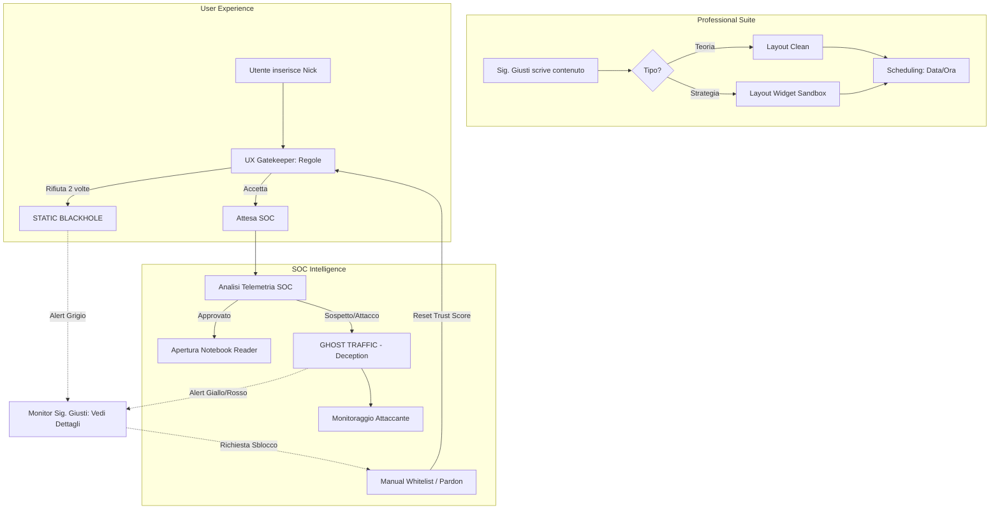

**Codice:** `GG-GLOBAL-MAP-V1`

**Obiettivo:** Visualizzare l'architettura dei link e i flussi di navigazione.

---

## 1. La Mappa delle Tre Fortezze (Sitemap)

La piattaforma è divisa in tre domini isolati, ognuno con la propria struttura di pagine.

### A. Dominio PROFESSIONISTA (`editor.giustipiattaforma.it`)

- **Login (mTLS Auth)**
    
- **Onboarding** (Tutorial "Benvenuto Sig. Giusti" - _Doc: ONBOARDING_GIULIANO_)
    
- **Dashboard Master** (_Doc: EDITOR_MASTER_)
    
    - Editor Teoria (Layout Ardesia)
        
    - Editor Strategie (Layout Black + Widget)
        
    - Pannello Scheduling (Calendario)
        
- **User Status Monitor** (Tabella Utenti + Tasto Dettagli Tecnici)
    

### B. Dominio UTENTE (`access.giustipiattaforma.it`)
* **Landing / Inserimento Nickname**
* **The Gatekeeper** (Animazione Benvenuto + 3 Regole)
* **Waiting Room** (Loop di caricamento in attesa di approvazione SOC)
* **Notebook Reader**
    * Area Teoria (Layout Ardesia)
    * Area Strategie (Layout Total Black)
        * **Sandbox Layer:** Contenitore isolato per Widget TradingView/Calcolatori.
* **The Black Hole (Stato post-ban):**
    * **Static View:** Caricamento infinito (per rifiuto policy).
    * **Deception View:** Ghost Traffic / Junk Data (per attacchi EDR).

### C. Dominio TECNICO (`soc.giustipiattaforma.it`)
* **Situation Room Dashboard**
    * Live Threat Feed (Grigio, Giallo, Rosso)
    * **Gestione Accessi & Pardon:**
        * Approve/Deny (Nuovi utenti)
        * **Manual Whitelist:** Sblocco manuale utenti bannati su richiesta del Professionista.
    * **Active Defense:** Global Kill Switch (Maker-Checker).

---

## 2. Global User Flow (Il Percorso dei Dati)

Questo diagramma mostra come un'azione in un dominio scatena una reazione negli altri.

Snippet di codice

---

## 3. Matrice delle Interazioni Critiche

Per garantire la "Super Semplicità", abbiamo ridotto i punti di attrito a queste azioni chiave:

| **Attore**      | **Azione Trigger**           | **Documento di Riferimento** |
| :-------------- | :--------------------------- | :--------------------------- |
| **Sistema**     | Iniezione Junk Data (Jitter) | `RESPONSE_TO_ATTACK`         |
| **Tecnico SOC** | Manual Pardon (Whitelist)    | `SITEMAP` / `EDR_SOC`        |
| **Wasm Core**   | postMessage a Widget Sandbox | `THEORY_VS_STRATEGY`         |

---

## 4. Conclusione della Progettazione

Caro collega, con questa Sitemap abbiamo completato il puzzle.

- Il **Sig. Giusti** ha il suo ufficio blindato e rispettoso.
    
- L'**Utente** sa che deve rispettare la fortezza o verrà espulso.
    
- Il **Tecnico** ha gli strumenti per proteggere tutto.
    

### Check-list Finale Consegna:

1. **Cartella 01:** Generale & Strategy Market (Fatto)
    
2. **Cartella 02:** Editor Master & Onboarding Giuliano (Fatto)
    
3. **Cartella 03:** Gatekeeper & Notebook Reader (Fatto)
    
4. **Cartella 04:** Interfaccia EDR SOC (Fatto)
    
5. **Cartella 05:** API Master Specifications (Fatto)