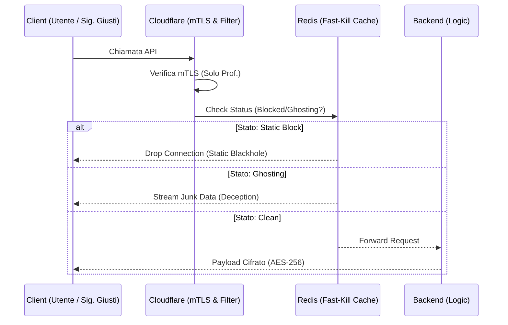
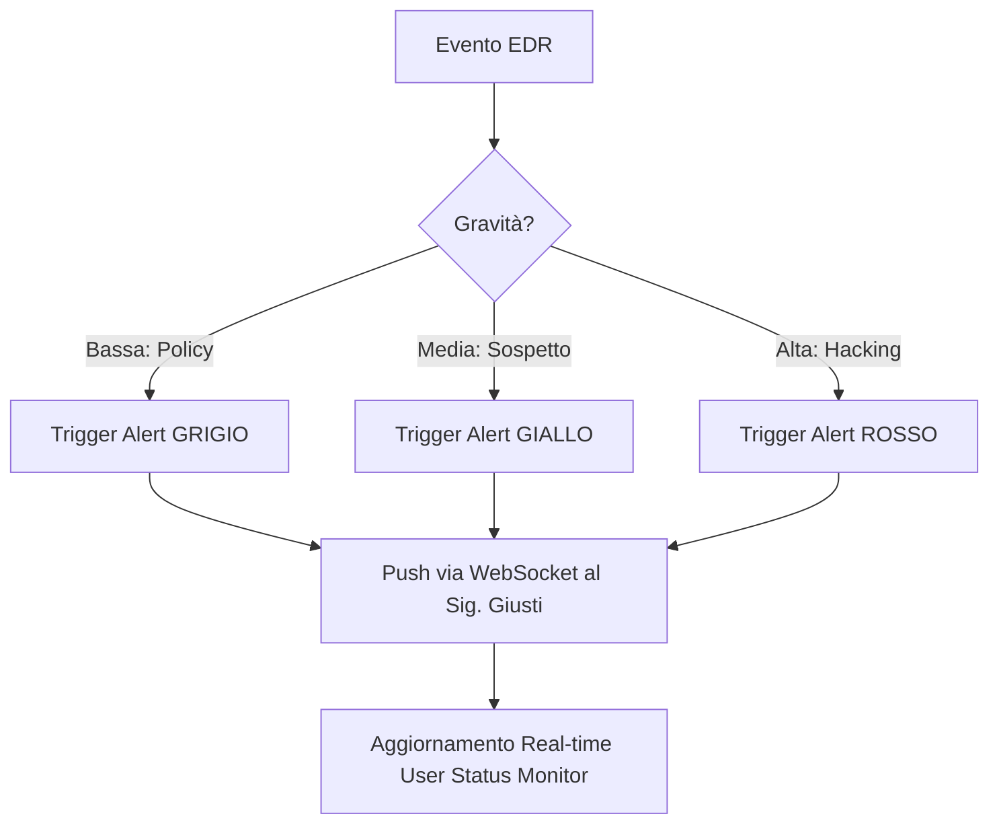

**Codice:** `GG-API-CORE-UNIFIED`

**Livello di Accesso:** Sviluppatori Senior / Security Lead

**Stato:** Integrato con Feature Sig. Giusti

---

## 1. Architettura di Sicurezza Globale (The Shield)

Prima di definire le rotte, stabiliamo le regole d'ingaggio per ogni chiamata:

- **Mutual TLS (mTLS):** Obbligatorio per le aree **Professional** (Sig. Giusti) e **SOC**. Nessun pacchetto viene accettato senza certificato hardware.
    
- **HMAC Signing:** Ogni log telemetrico (screenshot, hacking) deve essere firmato con `SHA-256` per prevenire lo spoofing.
    
- **End-to-End Encryption:** I contenuti del notebook viaggiano cifrati in `AES-256-GCM`. La chiave è gestita dal modulo **WebAssembly** (Wasm).


---

## 2. Definizione Rotte Unificate

### A. Area Gatekeeper & Auth (L'Ingresso)

Gestisce l'ingresso dell'utente e la nuova esperienza del "Contratto di Rispetto".

- **POST `/v1/gate/request`**
    
    - **Payload:** `{ "nickname": string, "hw_hash": string, "telemetry": object }`
        
    - **Azione:** Avvia il processo di fingerprinting.
        
-  **POST `/v1/gate/policy-response`**
    * **Payload:** `{ "nickname": string, "accepted": boolean, "attempt": integer }`
    * **Logica di Risposta:** * Se `accepted: false` e `attempt: 2` -> Il server restituisce `status: 403` e instrada l'IP verso lo **Static Blackhole** (nessun traffico dati ulteriore).
        * Viene inviato un evento `POLICY_REJECTION` (Alert Grigio) al monitor del Sig. Giusti.
        

### B. Area Professional Suite (Il Lavoro del Sig. Giusti)

Gestisce la creazione, lo scheduling e il monitoraggio.

- **POST `/v1/admin/publish`**
    
    - **Payload:** `{ "title": string, "content": blob, "type": "THEORY"|"STRATEGY" }`
        
    - **Sicurezza:** Richiede mTLS.
        
- **POST `/v1/admin/schedule` (NUOVA)**
    
    - **Payload:** `{ "content_id": uuid, "publish_at": "ISO-8601-Timestamp" }`
        
    - **Azione:** Inserisce il contenuto nella coda di rilascio temporale.
        
- **GET `/v1/admin/user-monitor` (NUOVA)**
    
    - **Payload:** `{ "filter": "ALL"|"BLOCKED" }`
        
    - **Azione:** Alimenta la tabella del Sig. Giusti con i nomi degli utenti e i loro stati.
        

### C. Area EDR & Intelligence (La Fortezza)

* **POST `/v1/soc/set-ghosting`** (NUOVO)
    * **Scopo:** Attivazione manuale o automatica del Ghost Traffic.
    * **Payload:** `{ "hw_hash": string, "jitter_range": [min, max], "duration": "infinite" }`
    * **Effetto:** Il server inizia a inviare Junk Data cifrati per simulare una connessione lenta e frustrare l'attaccante.

* **GET `/v1/security/widget-config`** (NUOVO)
    * **Scopo:** Fornisce i parametri di sandboxing per gli iframe dei widget.
    * **Response:** `{ "sandbox_rules": "allow-scripts allow-same-origin", "csp_headers": "default-src 'self' *.tradingview.com" }`
        


### 2.4 Protocollo postMessage (Wasm to Widget Bridge)
Per garantire che i widget (TradingView) non accedano alla memoria del Reader, la comunicazione API è sostituita da un bridge locale sicuro:

1. **Origin Check:** Il Reader accetta messaggi solo se `event.origin` è verificato.

2. **Payload Schema:** `{ "type": "DATA_UPDATE", "value": number, "signature": "hmac_sha256" }`

3. **No-Ingress:** I widget non hanno rotte API dirette per richiedere dati sensibili; possono solo ricevere ciò che il modulo Wasm decide di "trasmettere".


---

## 3. Schema delle Notifiche "Sig. Giusti"

Il sistema API instraderà le notifiche verso l'interfaccia del professionista secondo questa logica di routing:

Snippet di codice



---

## 4. Struttura del Pacchetto Dati (Payload Forense)

Per il tasto **"Vedi Dettagli"**, l'API deve restituire questo formato standardizzato:

JSON

```
{
  "status": "success",
  "data": {
    "violation": "TENTATO SCREENSHOT",
    "risk_score": "85%",
    "device_info": {
      "os": "MacOS Sonoma",
      "browser": "Safari",
      "is_virtual_machine": false
    },
    "location": {
      "city": "Milano",
      "isp": "Fastweb"
    },
    "log_history": ["Apre Pagina Strategia", "Rilevata pressione CMD+SHIFT+4"]
  }
}
```


# DOCUMENTO: API_MASTER_SPECIFICATIONS 
---

## 1. Architettura di Sicurezza Globale (The Shield)

Ogni chiamata API deve superare tre livelli di validazione prima di essere processata dal backend.

### 1.1 Diagramma: Flusso di Sicurezza Unificato

Snippet di codice

```
sequenceDiagram
    participant G as Client (Sig. Giusti / Utente)
    participant WAF as Cloudflare (mTLS Check)
    participant API as API Gateway (HMAC & Nonce)
    participant REDIS as Cache (Replay Protection)

    G->>WAF: Richiesta + Certificato Digitale
    WAF->>WAF: Valida Certificato mTLS
    WAF->>API: Inoltra Richiesta
    API->>REDIS: Verifica Nonce (Anti-Replay)
    REDIS-->>API: Nonce Valido
    API->>API: Verifica Firma HMAC (Integrità)
    API-->>G: 200 OK + Payload Cifrato AES-256
```

---

## 2. Definizione Rotte & Endpoint

### 2.1 Area Gatekeeper & Auth (Ingresso Utente)

Gestisce la "Fortezza" e la validazione del comportamento utente.

- **POST `/v1/gate/request`**
    
    - _Payload:_ `{ "nickname": string, "hw_hash": string, "telemetry": object }`
        
    - _Scopo:_ Inizializza la sessione "Pending".
        
- **POST `/v1/gate/policy-response`** (NUOVO)
    
    - _Payload:_ `{ "nickname": string, "accepted": boolean, "attempt": integer }`
        
    - _Logica:_ Gestisce il ban automatico dopo 2 rifiuti e innesca la notifica al Sig. Giusti.
        

### 2.2 Area Professional Suite (Editor Sig. Giusti)

Gestisce la creazione, lo scheduling e il monitoraggio degli utenti.

- **POST `/v1/admin/schedule`** (NUOVO)
    
    - _Payload:_ `{ "content_id": uuid, "release_date": "ISO-8601", "timezone": "string" }`
        
    - _Diagramma Logica Scheduling:_
        

Snippet di codice

```
graph TD
    A[Sig. Giusti: Crea Contenuto] --> B[Editor: Cifra con AES-256]
    B --> C{Pubblica Ora?}
    C -- SÌ --> D[Stato: LIVE]
    C -- NO --> E[Imposta Data/Ora Scheduling]
    E --> F[Stato: SCHEDULED - Locked in DB]
    F --> G[Worker: Controllo Orario]
    G --> H{Check: Ora Attuale >= Release_Date?}
    H -- SÌ --> D
    H -- NO --> F
```

- **GET `/v1/admin/user-monitor`** (NUOVO)
    
    - _Scopo:_ Alimenta la tabella "User Status Monitor".
        
    - _Response:_ Lista utenti con stati: `Active`, `Policy_Rejected`, `Blocked_EDR`.
        

### 2.3 Area EDR & SOC (Security Telemetry)

Gestisce i dettagli tecnici delle violazioni.

- **GET `/v1/soc/forensic-details/{user_id}`** (NUOVO)
    
    - _Destinazione:_ Popola il tasto **"Vedi Dettagli Tecnici"** nell'area del Sig. Giusti.
        
    - _Payload di Risposta:_
        

JSON

```
{
  "violation": "DEBUGGER_DETECTION",
  "evidence_score": 0.99,
  "telemetry": {
    "ip": "151.12.x.x",
    "hardware_id": "CPU-M2-8821",
    "location": "Milano, IT",
    "action_log": ["Open Reader", "Press F12", "Inject Script Attempt"]
  }
}
```

---

## 3. Sistema di Notifiche Push (Real-Time)

Questo componente assicura che il Sig. Giusti riceva gli alert (Grigio, Giallo, Rosso) istantaneamente tramite WebSocket.

Snippet di codice

```
graph LR
    A[Evento EDR / Gatekeeper] --> B{Severità?}
    B -->|REJECTION| C[Alert GRIGIO: Policy]
    B -->|SUSPICIOUS| D[Alert GIALLO: Sospetto]
    B -->|ATTACK| E[Alert ROSSO: Hacking]
    
    C & D & E --> F[API Gateway: Notify Sig. Giusti]
    F --> G[Pulsante 'Vedi Dettagli' Attivato]
```

---

## 4. Componenti di Sicurezza Dati

1. **HMAC Validation:** Ogni richiesta deve includere l'header `X-Signature`. Se manca o è errata, il SOC segnala un tentativo di "Log Spoofing".
    
2. **AES-256-GCM:** I contenuti del notebook sono cifrati a riposo. La chiave di decrittazione viene fornita solo dopo che il SOC ha cambiato lo stato dell'utente da `PENDING` ad `APPROVED`.
    
3. **Blackhole Trigger:** In caso di Alert Rosso, l'API Gateway inserisce l'IP dell'utente in una tabella di blocco hardware per 20 secondi (tempo del messaggio di addio) e poi lo isola permanentemente.