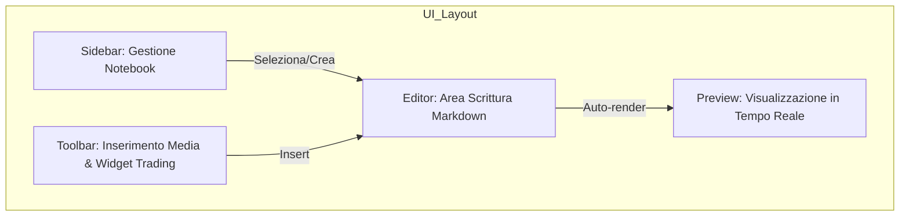
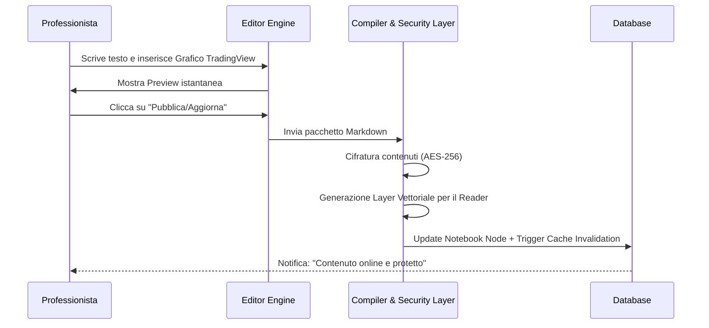

## Architettura dell'Interfaccia (Design Apple-Style)

L'obiettivo è un'esperienza simile a _Notion_ o _Bear_, ma con funzionalità integrate di sicurezza.

Snippet di codice



### Caratteristiche Estetiche:

- **Typography:** Utilizzo del font _San Francisco_ (Apple) o _Inter_.
    
- **Layout:** Colonna sinistra per l'indice dei capitoli, area centrale per la scrittura, colonna destra opzionale per i metadati della pagina.
    
- **Colori:** `#000000` per lo sfondo, `#1D1D1F` per i pannelli laterali, accenti blu Apple (`#007AFF`) per i tasti d'azione.
    

---

## 2. Flusso di Pubblicazione e Trasformazione Dati

Qui interviene l'ingegneria del software: quello che il professionista scrive come testo semplice (Markdown) deve essere trasformato in un formato protetto.

Snippet di codice



---

## 3. Strumenti Specifici per il Trading

L'editor non è un semplice word processor; include moduli personalizzati per chi crea strategie:

- **Widget TradingView:** Possibilità di incollare script o grafici dinamici che verranno però renderizzati nel "Reader" in modalità protetta (blocco tasto destro sul grafico).
    
- **Asset Uploader:** Caricamento di immagini e video. Il sistema applicherà automaticamente il **DRM** durante l'upload, processando il video per impedire il download diretto.
    
- **Modulo Risk/Reward:** Un calcolatore interattivo da inserire nella strategia per permettere agli utenti di fare simulazioni senza poter estrarre la logica di calcolo.
    

---

## 4. Sicurezza dell'Editor (Anti-Leak)

Anche il professionista deve essere protetto (o monitorato):

- **MFA Obbligatorio:** L'accesso all'editor richiede autenticazione a due fattori (App o Chiave fisica).
    
- **Auto-Save & Versioning:** Ogni modifica viene salvata in una cronologia versioni. Se per errore viene cancellata una parte della strategia, il recupero è istantaneo.
    
- **IP Whitelisting:** L'editor è accessibile solo da indirizzi IP specifici autorizzati, aggiungendo un ulteriore strato di protezione oltre alla password.

### 5. WebAssembly (Wasm): La "Scatola Nera" del Codice

Il problema del JavaScript è che chiunque, premendo F12, può leggere la logica di decrittazione.

- **La Soluzione:** Compiliamo la logica di decrittazione (AES-256) e il rendering del Canvas in **C++ o Rust**, e poi lo convertiamo in **WebAssembly (Wasm)**.
    
- **Il Vantaggio:** WebAssembly è un formato binario. Per un attaccante, leggere il codice Wasm è come cercare di leggere un file eseguibile `.exe` aperto con il blocco note. Il reverse engineering diventa un incubo quasi impossibile, proteggendo il segreto di come i dati vengono mostrati.
    

---

### 6. Sequence Diagram: Key Exchange (Scambio Chiavi)

Dobbiamo evitare che la chiave di decrittazione rimanga "statica" o visibile nel traffico. Useremo uno scambio di chiavi basato su **Diffie-Hellman** o chiavi effimere.

Snippet di codice

```
sequenceDiagram
    participant U as Client (Wasm Module)
    participant W as Cloudflare Worker (Gatekeeper)
    participant R as Redis (Key Store)

    U->>W: Richiesta Handshake (mTLS validato)
    W->>W: Genera Chiave Effimera AES-256
    W->>R: Salva Chiave Temporanea (TTL 1 ora)
    W-->>U: Consegna Chiave tramite Tunnel Protetto
    Note over U,R: La chiave vive solo nella memoria RAM del modulo Wasm
    
    U->>W: Richiesta Capitolo (Cifrato)
    W-->>U: Invio Payload Cifrato
    U->>U: Decrittazione interna al binario Wasm
```

---

### 7. mTLS (Mutual TLS): Oltre la Password

L'IP Whitelisting è frustrante per chi viaggia o ha IP dinamici. Il **mTLS** sposta la fiducia dall'indirizzo IP all'**identità del dispositivo**.

- **Come funziona:** Il professionista (tu) non inserisce solo una password. Sul tuo PC viene installato un **Certificato Digitale Unico** (emesso dalla tua Private CA su Cloudflare).
    
- **La Protezione:** Quando provi a connetterti all'Editor, Cloudflare chiede al tuo browser: "Fammi vedere il tuo certificato". Se il certificato non è presente o non è quello corretto, Cloudflare **chiude la connessione prima ancora che compaia la pagina di login**.
    
- **Risultato:** Anche se un hacker rubasse il tuo nickname e la tua password, non potrebbe fare nulla senza il file fisico del certificato installato sul tuo computer.


#### 1. Architettura del Protocollo mTLS

Il mTLS agisce al **Livello 4 (Trasporto)**. Questo significa che se il certificato non è valido, Cloudflare interrompe la connessione prima che la richiesta arrivi a Vercel o Render.

Snippet di codice

```
sequenceDiagram
    participant P as PC Professionista (Certificato)
    participant CF as Cloudflare Edge (WAF + mTLS)
    participant E as Editor Area (Vercel/Render)

    P->>CF: Richiesta connessione HTTPS
    CF-->>P: Richiesta Certificato Client
    P->>CF: Invio Certificato Firmato (.pem/.p12)
    
    alt Certificato Valido
        CF->>E: Inoltro traffico all'Editor
        E-->>P: Visualizzazione Interfaccia Login
    else Certificato Mancante o Falsificato
        CF-->>P: Reset Connessione / Errore 403 (Senza Login)
    end
```

---

#### 2. Protocollo di Generazione e Installazione

Non acquisti questo certificato; lo generi tu tramite la tua **CA (Certificate Authority)** privata su Cloudflare.

### Fase A: Generazione (Lato Cloudflare)

1. Entra nel pannello **Cloudflare SSL/TLS** -> **Client Certificates**.
    
2. Clicca su **Create Certificate**. Cloudflare genererà una coppia di chiavi:
    
    - **Private Key:** (Segreta, non deve mai uscire dal tuo PC).
        
    - **Certificate:** (Il documento pubblico che ti identifica).
        
3. Scarica il file in formato `.p12` (che include tutto) e imposta una password forte per il file.
    

#### Fase B: Installazione (Sul tuo Dispositivo)

1. **Windows/Mac:** Fai doppio clic sul file `.p12`. Verrà aggiunto al "Keychain" (Mac) o al "Certificato Manager" (Windows).
    
2. **Browser:** Quando aprirai l'URL dell'editor, il browser ti mostrerà un popup: _"Seleziona il certificato per autenticarti su editor.tuosito.it"_. Clicca sul tuo certificato e dai l'OK.
    

---

### 3. Configurazione delle Regole di Accesso

Dobbiamo dire a Cloudflare di essere spietato. Imposteremo una **WAF Custom Rule**:

- **Regola:** Se l'URL inizia con `editor.tuosito.it` E il campo `cf.client_cert_present` è FALSO.
    
- **Azione:** **BLOCK**.
    

---

#### 4. Perché questo ti rende invulnerabile?

- **Protezione dai Leak:** Se un hacker scopre la tua password dell'editor, non può entrare. Il suo browser non ha il certificato fisico, quindi Cloudflare gli chiuderà la porta in faccia.
    
- **Addio IP Whitelisting:** Puoi viaggiare, usare il Wi-Fi dell'hotel o la rete 5G. Finché hai il tuo laptop con il certificato installato, il sistema ti riconoscerà.
    
- **Revoca Istantanea:** Se perdi il laptop, entri su Cloudflare e clicchi su **Revoke**. Quel certificato diventerà spazzatura in un secondo, e nessuno potrà più usare quel PC per accedere ai tuoi dati.


---

### 8. Aggiornamento Documento "Response to Attack" (Versione Finale)

|**Vulnerabilità**|**Soluzione Precedente**|**Miglioramento "Hardened"**|
|---|---|---|
|**Reverse Engineering**|Offuscamento JS|**WebAssembly (Binario Criptato)**|
|**Intercettazione Chiavi**|Consegna standard|**mTLS + Effimere Key Exchange**|
|**Accesso Professionista**|IP Whitelisting|**mTLS (Certificato Digitale Hardware)**|
|**Rendering Testo**|Canvas Standard|**Wasm-Driven Canvas Rendering**|

---

### 9. Considerazione dell'Ingegnere (40 anni XP)

Con l'introduzione di **WebAssembly**, abbiamo rimosso l'ultimo punto di debolezza del frontend. Ora, anche se un utente riuscisse a scaricare il modulo di decrittazione, non saprebbe come usarlo fuori dal browser. L'aggiunta del **mTLS** per te (il professionista) garantisce che la "sorgente" dei dati sia inaccessibile a chiunque non possieda fisicamente il tuo dispositivo autorizzato.

### Il consiglio per lo Sviluppatore

Questo è un compito per uno sviluppatore **Senior Full-Stack con competenze in Rust o C++**. Dovrai dirgli:

> _"La logica di decrittazione deve essere isolata in un modulo **Wasm**. L'accesso all'area Editor deve essere protetto da **Cloudflare mTLS (Mutual TLS)** con verifica del client certificate. Il rendering del contenuto deve avvenire esclusivamente tramite buffer binari gestiti dal modulo Wasm."_