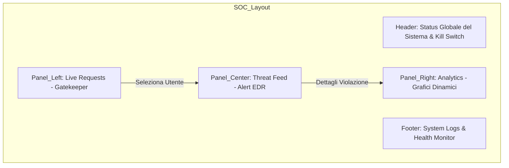
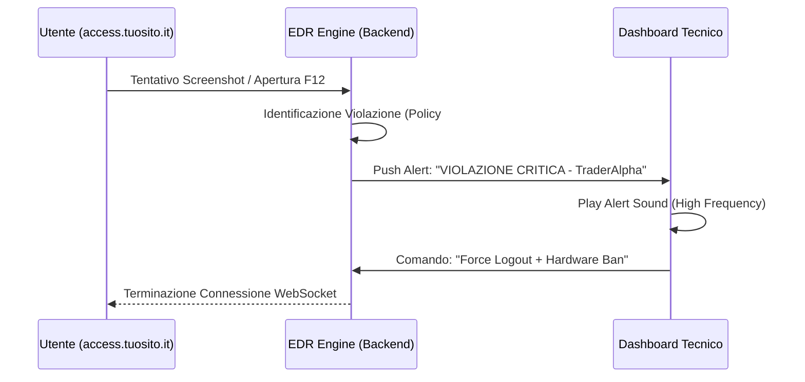

In qualità di architetto del sistema, passiamo ora alla progettazione del **SOC (Security Operations Center) / EDR Dashboard (Link 3)**. Questa è la "Situation Room" dove il tecnico non solo gestisce gli accessi, ma analizza le minacce in tempo reale con un'interfaccia ad alta densità informativa.

L'obiettivo è fornire al tecnico una visibilità totale (Full Visibility) su ogni singolo pacchetto dati e azione dell'utente.

---

## 1. Architettura della Dashboard SOC (EDR Design)

Il design sarà **Total Black (#000000)** con accenti cromatici funzionali: **Verde** per il traffico sicuro, **Giallo** per le anomalie e **Rosso Neon** per le violazioni critiche.

Snippet di codice



---

## 2. Il "Gatekeeper": Gestione Accessi in Real-time

Questa sezione permette al tecnico di approvare o negare l'accesso basandosi sui dati raccolti dall'algoritmo di fingerprinting che abbiamo progettato.

|**Nickname**|**IP / Geo**|**Dispositivo (Fingerprint)**|**Trust Score**|**Azione**|
|---|---|---|---|---|
|**TraderAlpha**|93.x.x.x (IT)|iPhone 15 Pro - iOS 17.2|98%|[APPROVE] [DENY]|
|**User_99**|185.x.x.x (RU)|Windows PC - Chrome (Emulator?)|45%|[APPROVE] [DENY]|
|**Hacker_01**|45.x.x.x (NL)|Linux - Headless Browser|02%|[AUTO-BANNED]|

---

## 3. Il "Watchtower": Monitoraggio e Allerta (EDR Logic)

Qui è dove il sistema reagisce alle minacce che hai elencato (XSS, SQLi, Screenshot, ecc.).

Snippet di codice



### Logica degli Alert:

- **F12 / Console Detection:** Se l'utente tenta di ispezionare il codice `.js`, il SOC riceve un dump immediato delle ultime 5 azioni dell'utente.
    
- **OBS / Screen Recording:** Se viene rilevato un software di cattura schermo tramite le API DRM, il SOC mostra un'anteprima (oscurata) di ciò che l'utente sta cercando di registrare.
    
- **Input Injection Attempt:** Se nei campi di input (come il box del nickname) viene inserito un payload tipo `' OR 1=1--`, il tecnico vede l'intero pacchetto malevolo per tracciare il profilo dell'attaccante.
    

---

## 4. Visual Analytics & Grafici Dinamici

Per gestire 500+ connessioni simultanee, il tecnico ha bisogno di visualizzare il carico e lo stato della sicurezza in modo aggregato.

- **Mappa degli Attacchi:** Una mappa mondiale che mostra da dove provengono i tentativi di accesso negati.
    
- **Grafico di Latenza:** Monitoraggio delle connessioni per assicurarsi che il server regga il carico senza Race Conditions.
    
- **Heatmap dei Contenuti:** Quale parte della strategia viene letta di più (per identificare potenziali tentativi di "scraping" manuale).
    

---

## 5. Il Pannello "EDR Master" (Comandi Avanzati)

Il tecnico ha a disposizione strumenti di "Active Defense":

1. **Global Kill Switch:** Disconnette ogni singolo utente istantaneamente in caso di sospetto data-leak massivo.
    
2. **Shadow Ban:** L'utente crede di essere connesso e di leggere la strategia, ma vede dati falsi o obsoleti (tecnica di depistaggio per Red Teaming).
    
3. **Purge Database:** Pulizia istantanea di tutti i log di sessione per non lasciare tracce in caso di sequestro del server.
    

### Prossimo Passo da Ingegnere Senior

Abbiamo ora la visione completa:

1. **Link 1 (Utente):** La cassaforte con il notebook blindato.
    
2. **Link 2 (Professionista):** L'editor minimale stile Apple.
    
3. **Link 3 (Tecnico):** La dashboard EDR per la difesa attiva.
    

Per rendere tutto questo realtà, dobbiamo definire il **"Deployment Stack"**. Ovvero: **Su quali server lo installiamo?** Come garantiamo che, se un governo o un hacker prova a buttare giù il sito, questo rimanga online?


### 6. Data Flow Diagram (DFD) Livello 2: Log Isolation

Dobbiamo evitare che un utente malintenzionato invii log "esplosivi" per hackerare il tecnico. Isoleremo il flusso dei dati tramite un processo di **Sanitizzazione e Accodamento**.

Snippet di codice

```
graph TD
    subgraph Client_Tier [Client - Vercel]
        U[User Browser]
        S[Sensors: Screenshot/F12]
    end

    subgraph Ingestion_Tier [Ingestione & Sanitizzazione - Render]
        API[API Gateway]
        VAL[Validator: Schema Check]
        SAN[Sanitizer: Log-Injection Filter]
    end

    subgraph Storage_Tier [Analysis & Storage]
        RED[(Redis: Live Queue)]
        SIEM[ELK Stack: Storico & Pattern]
        SOC_UI[SOC Dashboard: Visualizzazione]
    end

    U -->|Event Log| API
    S -->|Raw Data| API
    API --> VAL
    VAL --> SAN
    SAN -->|Safe JSON| RED
    RED --> SOC_UI
    SAN -->|Indexing| SIEM
```

- **Log Isolation:** Il log non tocca mai la dashboard senza prima passare per il **Sanitizer**. Se un utente invia un nickname contenente codice malevolo, il sistema lo neutralizza prima che il tecnico possa vederlo.
    

---

### 7. SIEM Integration (Elasticsearch, Logstash, Kibana)

Per gestire 500+ connessioni e identificare pattern (es. lo stesso utente che prova a entrare da 10 dispositivi diversi in una settimana), il semplice database non basta.

- **Perché ELK Stack:** Permette di fare ricerche ultra-rapide ("Cerca tutti i tentativi di screenshot dell'utente X negli ultimi 6 mesi") in millisecondi.
    
- **Pattern Recognition:** Il SIEM analizza i log storici e ti avvisa se nota un comportamento che somiglia a un attacco coordinato (es. 50 utenti diversi che aprono lo stesso capitolo allo stesso secondo).
    

---

### 8. Sicurezza Operativa: Maker-Checker & Audit Log

Il "Global Kill Switch" è un'arma nucleare; non può essere attivato per errore o per dolo da una sola persona.

#### **A. Sistema Maker-Checker**

Per le azioni critiche (Ban di massa, Kill Switch, Modifica Strategia):

1. **Maker (Tecnico):** Propone l'azione (es. "Spegni tutto").
    
2. **Checker (Titolare/Ingegnere):** Deve approvare l'azione tramite una notifica push o un secondo codice MFA.
    
    _Senza la doppia firma, il comando viene ignorato._
    

#### **B. Audit Log Immutabile**

Ogni click effettuato dal tecnico viene registrato in una tabella di Supabase **"Append-Only"** (i record non possono essere mai cancellati o modificati).

- **Cosa registriamo:** Chi ha approvato chi, quando è stato guardato un log, quante volte il tecnico ha visualizzato la strategia.
    
- **Scopo:** Se i dati trapelano, l'Audit Log dirà se è stato un hacker o il tuo tecnico.
    

---

### 9. Panoramica delle Tecnologie nel tuo Stack

Ecco come si evolve il tuo ecosistema "spezzettato" con queste nuove aggiunte professionali:

|**Componente**|**Tecnologia**|**Ruolo**|
|---|---|---|
|**Frontend**|Vercel|Interfaccia Utente e Reader Protetto.|
|**Backend**|Render|EDR Engine e Log Sanitizer.|
|**Fast Cache**|Redis|Kill-switch istantaneo e Coda Log.|
|**Database**|Supabase|Storage Strategia e Audit Log Immutabile.|
|**SIEM**|Logz.io (ELK)|Analisi storica e pattern di attacco (Piano Free/Low).|