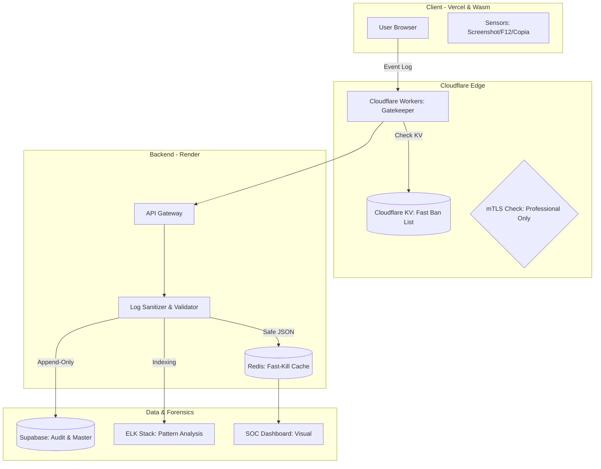
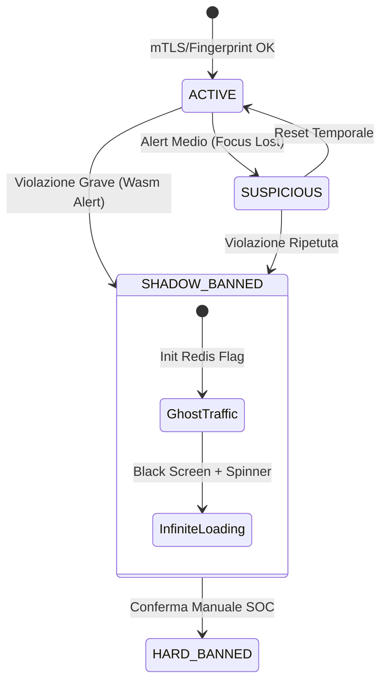
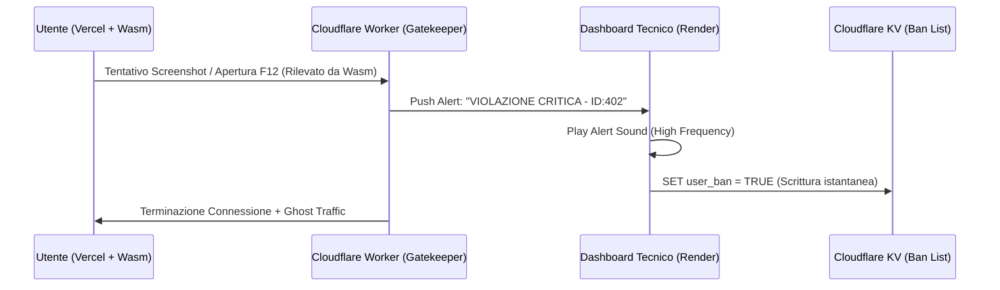

# MASTER SPEC: EDR SOC & INFRASTRUCTURE (v.4.0 Final)

**Codice Progetto:** `SOVEREIGN-FORTRESS-2024`

**Classificazione:** TOP SECRET / MISSION CRITICAL

**Architettura:** Multi-Cloud Resilient (Vercel + Render + Cloudflare Edge)

---

## 1. Architettura di Infrastruttura e Sicurezza (The Backbone)

Il sistema non si basa su un singolo server, ma su un'infrastruttura **Immutable & Provider-Agnostic** gestita tramite **Terraform**.

### 1.1 Diagramma di Flusso Dati e Isolamento (DFD Livello 2)

Ogni log o interazione viene filtrata e processata per evitare attacchi di tipo "Log-Injection" verso la dashboard del tecnico.

Snippet di codice

---

## 2. Design dell'Interfaccia SOC (The Command Center)

L'interfaccia deve seguire il canone **Total Black (#000000)** con estetica ad alta densità informativa "Matrix-Style".

### 2.1 Layout della Situation Room

1. **Top Bar (System Health):** Status dei nodi (Edge, Backend, DB) + **Global Kill Switch** (Doppia conferma Maker-Checker).
    
2. **Left Panel (The Gate):** Coda PENDING per approvazione nuovi accessi basata su Trust Score.
    
3. **Center Canvas (Threat Feed):** Scrolling rapido degli eventi filtrati per severità (Grigio, Giallo, Rosso).
    
4. **Right Panel (Forensics):** Telemetria hardware UUID, OS, ISP, e replay logico delle ultime azioni.
    

### 2.2 Reattività Visiva (Color Palette)

- **#00FF00 (Verde Matrix):** Traffico validato e utente attivo.
    
- **#FFFF00 (Giallo Neon):** Violazione policy (es. Tab switch, mouse fuori area).
    
- **#FF0000 (Rosso Alert):** Violazione critica (Screenshot, Debugger, Ghosting attivo).
    

---

## 3. Logica di Protezione Hardened (Il Motore)

### 3.1 State Machine della Sessione

Gestione atomica degli stati tramite **Redis** per eliminare race conditions.

Snippet di codice

### 3.2 Crittografia e WebAssembly (Wasm)

- **Wasm Module:** La logica di decrittazione AES-256 e il rendering dei dati nel Canvas sono compilati in binario. Il codice sorgente non è leggibile tramite F12.
    
- **Key Exchange:** Chiavi effimere generate per ogni sessione, salvate su Redis con TTL (Time-To-Live) di 60 minuti.
    
- **Ghost Traffic:** In stato `SHADOW_BANNED`, il server invia pacchetti "junk" cifrati con jitter casuale (0.8s - 1.5s) per simulare un caricamento reale nel Network Tab del browser.
    

---

## 4. Protocolli di Accesso Professionista (mTLS)

L'accesso all'area Editor/Master è protetto da **Mutual TLS**.

- **No IP Whitelisting:** Troppo fragile.
    
- **Certificato Digitale:** Il professionista deve installare un certificato emesso dalla Private CA su Cloudflare. Senza il certificato fisico, Cloudflare resetta la connessione a livello di protocollo (Handshake Failure).
    

---

## 5. Risposta alle Violazioni e Forensics

|**Evento**|**Severità**|**Azione Sistema (Redis/Worker)**|**Notifica Titolare**|
|---|---|---|---|
|**Tentativo Copia**|Bassa|Blocco evento UI|Log Informativo|
|**Apertura Console**|Alta|Shadow Ban Istantaneo|Alert Sospetto|
|**Screenshot/REC**|Critica|Blackhole + Ghost Traffic|Alert Critico|
|**Anomalia Pattern**|Media|Richiesta Re-Validation|Log Analisi|

---

## 6. Disaster Recovery & IaC (Infrastructure as Code)

Tutta l'infrastruttura è definita in file **Terraform**.

- **Failover:** Se Vercel subisce un attacco o un ban, lo script Terraform re-deploya l'intero frontend su un provider secondario (Netlify o VPS privata) in < 5 minuti.
    
- **Audit Log Immutabile:** Ogni azione del tecnico SOC è registrata su una tabella Supabase "Append-only" cifrata, rendendo impossibile la cancellazione dei log da parte di insider malevoli.

### 7.  "Watchtower" (EDR Logic)

La logica di reazione non è sparita, è diventata più veloce. Ora il comando di "Force Logout" non passa solo dal backend, ma viene eseguito istantaneamente sull'Edge di Cloudflare.

Snippet di codice

- **F12 / Console Detection:** Grazie a **WebAssembly**, se l'utente tenta di ispezionare il codice, il modulo Wasm invia al SOC un "Forensic Dump" cifrato.
    
- **OBS / Screen Recording:** Confermiamo la protezione DRM. Se il tecnico vede l'alert, può attivare lo **Shadow Ban** manuale con un click.
    
- **Input Injection:** Ogni tentativo di SQLi viene bloccato dal WAF di Cloudflare e il payload viene inviato al SIEM per l'analisi del profilo dell'attaccante.
    

---

### 8. Visual Analytics & Grafici (Dashboard 500+ Utenti)

Per gestire volumi elevati, integriamo i grafici con l'**ELK Stack (SIEM)** che abbiamo aggiunto:

- **Mappa degli Attacchi (Geo-IP):** Visualizzazione in tempo reale su mappa mondiale (dati provenienti dai log di Cloudflare).
    
- **Grafico di Latenza & Race Conditions:** Fondamentale per monitorare che Redis e i Workers rispondano in meno di 10ms.
    
- **Heatmap dei Contenuti (Scraping Detection):** Monitoriamo quali "sezioni" del Canvas Wasm vengono renderizzate più spesso. Se un utente visualizza 100 pagine in 10 secondi, il SOC lo segna automaticamente come "Bot/Scraper".
    

---
### 9. Pannello "EDR Master" (Active Defense & Intelligence)

Questi comandi rappresentano l'autorità suprema del tecnico sulla piattaforma e sono progettati per neutralizzare ogni minaccia in meno di un secondo.

#### 9.1 Global Kill Switch (Protocollo di Isolamento)

- **Logica:** Implementato con sistema **Maker-Checker**. Richiede la proposta del tecnico e la conferma immediata del Titolare (Sig. Giusti) o di un secondo supervisore.
    
- **Azione:** Il Worker di Cloudflare propaga l'ordine all'Edge globale in 0.5 secondi. Qualsiasi richiesta in entrata riceve un `403 Forbidden` o viene reindirizzata a una pagina di manutenzione statica.
    
- **Impatto:** Svuotamento istantaneo di tutte le chiavi di decrittazione nei moduli Wasm attivi.
    

#### 9.2 Defensive Routing (Ban Differenziato)

A seconda della gravità rilevata, il tecnico (o l'automatismo EDR) attiva uno dei due protocolli di esclusione:

- **A. Static Blackhole (Per Rifiuto Policy - Alert Grigio):**
    
    - **Metodo:** L'utente viene inserito in una lista di blocco passiva.
        
    - **Risultato:** Il server interrompe ogni invio di dati. L'utente visualizza un caricamento infinito statico. Risparmio massimo di banda e risorse server per utenti non conformi ma non ostili.
        
- **B. Ghost Traffic / Shadow Ban (Per Violazioni EDR - Alert Giallo/Rosso):**
    
    - **Metodo:** **Advanced Deception**. Il server finge che la sessione sia attiva ma degradata.
        
    - **Risultato:** Vengono inviati pacchetti di **Junk Data** (dati casuali cifrati) con un ritardo variabile (_Jitter_). L'attaccante rimane intrappolato nel tentativo di analizzare dati privi di valore, perdendo tempo e risorse mentre il sistema lo ha già neutralizzato.
        

#### 9.3 Purge & Sanitization (Data Hygiene)

- **Azione:** Consente la "Pulizia Rapida" delle tracce volatili. Elimina istantaneamente i log di sessione sensibili da Redis e i dati temporanei da Supabase.
    
- **Integrità:** Questa funzione **non influisce** sull'Audit Log. Ogni azione di "Purge" viene essa stessa registrata permanentemente nel log immutabile, garantendo che nessuno (nemmeno il tecnico) possa agire nell'ombra.