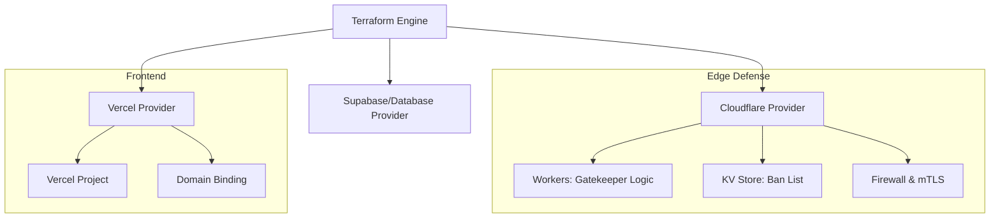

# TERRAFORM INFRASTRUCTURE BLUEPRINT (The Failover Manual)

**Codice Progetto:** `BLACK-VAULT-IaC-STRATEGY`

**Versione:** 1.0 (Militare)

**Obiettivo:** Definizione dell'Infrastruttura come Codice (IaC) per la resilienza Multi-Cloud.

---

## 1. Architettura dei Provider (Orchestrazione)

Il sistema utilizza Terraform per dialogare simultaneamente con i tre pilastri della tua infrastruttura. Il Blueprint impone l'uso di **Provider Ufficiali** per garantire la massima stabilità.

Snippet di codice

---

## 2. Struttura dei Moduli (Scomposizione Logica)

Il codice Terraform non deve essere un unico file caotico, ma diviso in **moduli indipendenti**. Questo permette di cambiare, ad esempio, il fornitore del frontend senza toccare la logica di sicurezza.

### 2.1 Modulo `networking_security` (Cloudflare)

- **DNS Management:** Configurazione automatica dei record CNAME e A.
    
- **WAF Rules:** Scripting delle regole firewall (es. blocco di tutti i paesi tranne quelli autorizzati).
    
- **mTLS Setup:** Generazione della configurazione per la richiesta dei certificati client ai "Professionisti".
    

### 2.2 Modulo `edge_compute` (Cloudflare Workers)

- **Worker Deployment:** Caricamento del codice JavaScript del "Gatekeeper" che gestisce il ban.
    
- **KV Namespace:** Creazione del database ultra-rapido (Key-Value) che contiene la lista nera degli utenti.
    
- **Cron Triggers:** Configurazione di task automatici per la pulizia dei log temporanei.
    

### 2.3 Modulo `application_frontend` (Vercel)

- **Environment Variables:** Iniezione automatica delle chiavi segrete (API Keys) nel frontend in modo che non siano mai scritte in chiaro nel codice.
    
- **Deployment Protection:** Configurazione dei permessi di accesso per l'anteprima del sito.
    

---

## 3. Politica di Gestione dei Segreti (Zero-Leak)

Il Blueprint vieta tassativamente di salvare password o token all'interno dei file Terraform.

- **Secret Manager:** Terraform deve leggere le chiavi da variabili d'ambiente protette o da un Vault (es. GitHub Secrets).
    
- **State Encryption:** Il file `terraform.tfstate` (che contiene la "mappa" della tua fortezza) deve essere salvato in un **Backend Remoto Cifrato** (S3 o Terraform Cloud). Se perdi questo file, perdi il controllo dell'infrastruttura.
    

---

## 4. Protocollo di Disaster Recovery (Il "Bottone Rosso")

Questo è il motivo per cui hai pagato per Terraform. In caso di attacco massiccio o ban del provider:

1. **Analisi:** Identificazione del provider compromesso (es. Vercel).
    
2. **Switch:** Modifica del puntamento nel file `main.tf` verso un provider di backup (es. Netlify).
    
3. **Execution:** Comando `terraform apply -auto-approve`.
    
4. **Ripristino:** Il traffico viene reindirizzato sulla nuova infrastruttura in meno di 300 secondi.
    

---

## 5. Checklist per lo Sviluppatore (SLA di Consegna)

Lo sviluppatore, per ricevere il pagamento del modulo Terraform, deve consegnare:

- [ ] Cartella `/terraform` con i moduli separati.
    
- [ ] File `README_INFRA.md` con le istruzioni per l'installazione.
    
- [ ] Configurazione del **Remote State** per evitare la perdita dei dati di configurazione.
    
- [ ] Test di "Dest