**Codice Progetto:** `BLACK-VAULT-PROTOCOL`

**Architetto:** _Senior Systems Lead (40y Experience)_ **Status:** Ready for Deployment

---

## 1. VISIONE ARCHITETTURALE: LA FILOSOFIA "SOVEREIGN"

La **Teoria** ci dice che l'utente deve leggere un contenuto. La **Strategia** ci impone di trattare ogni utente come un potenziale attaccante finché non è provato il contrario (**Zero Trust Architecture**).

### 1.1 Diagramma Infrastrutturale Multi-Cloud (The Resilient Web)

Non ci fidiamo di un solo provider. Se Vercel cade o censura, la strategia si sposta istantaneamente. Tutto è gestito tramite **Terraform (Infrastructure as Code)**.

Snippet di codice

```
graph TD
    subgraph Traffic_Layer [Cloudflare Edge - The Shield]
        W[Cloudflare Workers: Gatekeeper]
        KV[(Cloudflare KV: Global Ban List)]
        mTLS{mTLS: Professional Access}
    end

    subgraph Compute_Layer [Execution - The Brain]
        V[Vercel: Frontend & Wasm Delivery]
        R[Render: Backend EDR & SOC]
        RED[(Upstash Redis: Ultra-Fast State)]
    end

    subgraph Data_Layer [Storage - The Vault]
        DB[(Supabase: Audit & Persistence)]
        ELK[ELK Stack: Forensics SIEM]
    end

    W -->|Fast Check| KV
    W -->|Validates| V
    V -->|Requests| R
    R -->|Verifies| RED
    R -->|Logs| DB
    R -->|Indexes| ELK
```

---

## 2. IL "WATCHTOWER": EDR SOC INTERFACE

La dashboard del tecnico non è solo monitoraggio; è un'arma di difesa attiva.

### 2.1 Componenti della Dashboard (UI Progettazione)

- **Mappa degli Attacchi (Geo-IP):** Visualizzazione dei tentativi di violazione filtrati dal WAF.
    
- **Heatmap dei Contenuti:** Tracciamento della velocità di lettura per identificare bot di scraping.
    
- **Threat Feed con Forensic Dump:** Ogni alert (F12, Screenshot) mostra i metadati hardware (UUID, OS, Batteria, ISP).
    

### 2.2 Ciclo di Vita dell'Evento e Reazione (Sequence Diagram)

Snippet di codice

```
sequenceDiagram
    participant U as Utente (Wasm Module)
    participant W as Cloudflare Worker (Edge)
    participant SOC as Dashboard Tecnico (Render)
    participant GT as Ghost Traffic Engine

    U->>W: Violazione Rilevata (Screenshot/Copia)
    W->>SOC: Push Alert: "VIOLAZIONE CRITICA - ID:402"
    SOC->>SOC: Play Alert Sound (High Frequency)
    
    rect rgb(20, 20, 20)
    Note over W, GT: Protocollo Shadow Ban Attivato
    SOC->>W: Update KV: Status=BANNED
    W->>GT: Start Ghost Traffic (Junk Data)
    W->>U: Render: Total Black + Spinner
    end
```

---

## 3. PROTEZIONE HARDENED (THEORY VS STRATEGY)

### 3.1 WebAssembly (Wasm) vs JavaScript

- **Teoria:** Offuscare il codice JS per renderlo difficile da leggere.
    
- **Strategia (Militare):** Eliminare il JS per la logica critica. La decrittazione AES-256 e il rendering del Canvas avvengono in un **binario Wasm** (compilato da Rust). Il codice non è leggibile dall'Ispeziona Elemento.
    

### 3.2 Key Exchange & mTLS

- **Per l'Utente:** Chiavi effimere consegnate tramite tunnel cifrato, valide solo per la sessione corrente e memorizzate esclusivamente nella RAM del modulo Wasm.
    
- **Per il Professionista:** **mTLS (Mutual TLS)**. Non basta una password. Senza il certificato digitale installato fisicamente sul dispositivo del professionista, Cloudflare chiude la connessione a livello di protocollo prima ancora che la pagina venga caricata.
    

---

## 4. IL PANNELLO "EDR MASTER": COMANDI AVANZATI

|**Comando**|**Logica Teorica**|**Strategia Strategica (Militare)**|
|---|---|---|
|**Global Kill Switch**|Disconnette tutti gli utenti.|**Maker-Checker:** Richiede la firma digitale del Titolare per essere attivato. Cripta i buffer di memoria istantaneamente.|
|**Ghosting Mode**|Mostra errori di caricamento.|**Deception:** Invia pacchetti finti (Junk) con ritardi casuali per far credere all'hacker di avere problemi di linea.|
|**Audit Log**|Salva chi entra e chi esce.|**Immutabilità:** Log scritti in modalità "Append-Only" su Supabase. Nemmeno il tecnico può cancellare le tracce delle proprie azioni.|

---

## 5. DESIGN DELL'INTERFACCIA (TOTAL BLACK UI)

L'interfaccia deve urlare sicurezza e minimalismo estremo.

1. **Sfondo:** `#000000` puro.
    
2. **Elementi SOC:** Testo verde Matrix (`#00FF00`) per i flussi di dati, rosso Neon (`#FF0000`) per i blocchi.
    
3. **Il "Black Hole":** Quando scatta il ban, l'interfaccia deve svuotarsi completamente. Rimane solo una rotellina di caricamento standard (`z-index: 9999`) che gira all'infinito su sfondo nero. Nessuna scritta "Sei stato bannato", nessun feedback all'attaccante.
    

---

## 6. DISASTER RECOVERY & RESILIENZA (Terraform)

Ogni singolo bit di questa infrastruttura deve essere scritto in **Terraform**.

- **Recovery Time Objective (RTO):** < 5 minuti.
    
- **Procedura:** Se il provider primario fallisce, lo sviluppatore esegue `terraform apply` e l'intera fortezza rinasce su un provider geograficamente distante (es. dalla Virginia alla Svizzera).


### 7. SICUREZZA DEI WIDGET DINAMICI (Sandboxing Protocol)

L'integrazione di strumenti di terze parti (TradingView, Calcolatori, Chart dinamici) deve seguire il principio del **Privilegio Minimo**. Nessun widget esterno può comunicare con il "Core" del Notebook Reader.

#### 7.1 Architettura di Isolamento: Iframe Sandboxed

Ogni widget viene renderizzato all'interno di un contenitore isolato (Iframe) con attributi di sicurezza restrittivi.

- **Attributo Sandbox:** `sandbox="allow-scripts allow-same-origin"` (impedisce l'accesso a popup, download, e soprattutto impedisce di uscire dal contenitore per leggere il DOM della pagina madre).
    
- **Content Security Policy (CSP):** Il server invia un header specifico che permette l'esecuzione di script solo dai domini autorizzati (es. `*.tradingview.com`).
    

#### 7.2 Diagramma: Flusso di Isolamento Widget

Snippet di codice



```mermaid
graph TD
    subgraph Browser_Tab [Pagina Notebook Reader - Memoria Protetta]
        C[Core Reader: Testo Strategia Cifrato]
        W_Container[Contenitore Widget - Iframe]
    end

    subgraph External_World [Server Terze Parti]
        TV[Server TradingView]
    end

    %% Sintassi ultra-compatibile
    C -- "ACCESSO NEGATO" --- W_Container
    W_Container -- "Richiesta Dati" --> TV
    TV -- "Script e Dati" --> W_Container
    
    style C fill:#000,stroke:#f00,stroke-width:2px
    style W_Container fill:#1a1a1a,stroke:#007AFF,stroke-width:2px
```

#### 7.3 Comunicazione Unidirezionale (Wasm Bridge)

Se il widget necessita di dati calcolati dal nostro motore (es. un calcolatore di lotti che legge il prezzo dal motore del Sig. Giusti), la comunicazione avviene tramite un **Bridge Unidirezionale**:

1. Il **Core Wasm** calcola il dato.
    
2. Il dato viene inviato al widget tramite `postMessage` (un sistema di messaggistica sicuro tra finestre).
    
3. Il Widget riceve il dato ma **non può rispondere** né richiedere altri dati non esplicitamente inviati.
    

---

### Perché questa aggiunta è fondamentale:

- **Protezione Anti-Scraping:** Impedisce a script malevoli nascosti nei widget di "leggere" il contenuto del notebook e inviarlo all'esterno.
    
- **Stabilità:** Se un widget di TradingView crasha o rallenta, il Reader del Sig. Giusti rimane fluido e reattivo perché gira su un processo isolato.
    
- **Conformità EDR:** Il nostro sistema SOC può monitorare se un widget tenta di fare azioni non permesse (es. accedere al microfono o alla posizione), bloccandolo istantaneamente.